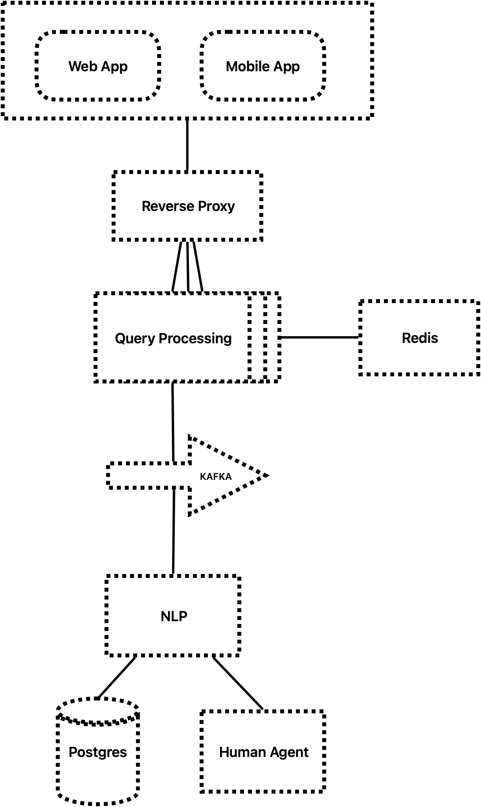

## Prompt

Backend Engineer Task (Brief Solution Proposal + Code)

Scenario:
You are tasked with designing a back-end system to automate customer support using AI agents. The system should handle customer queries in real time, use NLP to understand them, and respond with appropriate answers from a knowledge base or escalate to a human agent if needed.

Key Requirements:
Use AI/NLP for query understanding.
Connect to a database to retrieve answers.
Ensure the system can scale efficiently.

Task:
Design a high-level architecture for the back-end system:
Briefly describe the components of the system, such as:
The AI agent for understanding customer queries.
A database to store knowledge and provide responses.
A queueing system for managing real-time interactions.
Ensure scalability to handle multiple requests concurrently.

Write a piece of code to:
Simulate a simple query processing system.
Retrieve a response from a database (can be a mock or in-memory DB).
Use a basic NLP model (e.g., spaCy or transformers) to identify intents in customer queries.

Example:
Write a function to simulate an AI agent processing a query.
Write a function to query a mock database and return an answer.

Deliverables:
Architecture diagram (brief description).
A code snippet (1-2 pages) that implements:
A simple query handling function.
An NLP-based intent recognition and mock database query.

## Design

